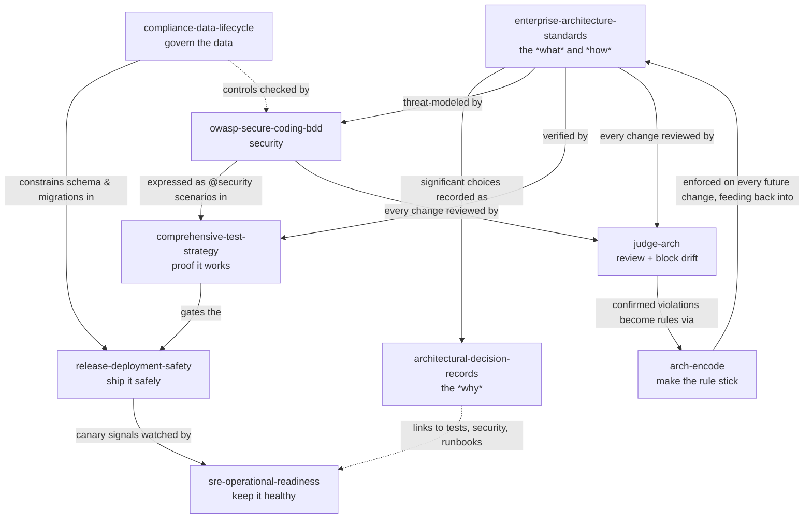

# Engineering Standards — Portable Agent Skills

[](LICENSE)
[](CONTRIBUTING.md)


Created and maintained by **[Tech Fleet](https://techfleet.org)**.

A set of fourteen model-agnostic **skills**: condensed, actionable engineering
standards that an AI coding agent — or a person — can load as context. Each one
encodes the judgment a senior engineer applies to a change (how to secure it,
how to test it, how to release it, why it was decided that way) so that *every*
change can meet the same bar, not just the ones a specialist happens to review.

They come in two groups: **eleven engineering-standards** skills at the top level
(security, testing, architecture, release, SRE, compliance, ADRs, plus architectural
review, rule-encoding, verifiable quality gates, and skeptical self-audit) and three
**[requirements](requirements/)** skills that make what you build work for
*everyone* — every browser and device, every ability, and anyone regardless of
context or expertise.

The content is deliberately **vendor-neutral** — no reference to any specific
model, assistant, or tool — so it works with any LLM or agent framework, and
reads perfectly well as plain engineering documentation for a human.

> **New to this?** Think of a skill as a short, expert checklist your AI coding
> assistant reads automatically when it's relevant — "you're touching auth, so
> here's how to not get owned." You don't have to remember to ask; the skill's
> description tells the tool when to pull it in.

---

## Table of contents

- [Why this exists](#why-this-exists)
- [The skills](#the-skills)
- [Requirements skills (universal quality)](#requirements-skills-universal-quality)
- [What is a "skill"?](#what-is-a-skill)
- [Install and use](#install-and-use)
- [Always-on: fire every skill on every task](#always-on-fire-every-skill-on-every-task)
- [How the skills fit together](#how-the-skills-fit-together)
- [Design principles](#design-principles)
- [Contributing](#contributing)
- [Repository layout](#repository-layout)
- [License](#license)
- [Acknowledgements](#acknowledgements)

---

## Why this exists

Most of what separates production-grade software from a working prototype is
**judgment that lives in people's heads**: the security engineer who knows the
lockout check has to run before the delete, the SRE who insists on an SLO before
launch, the architect who writes down *why* Postgres and not DynamoDB. That
knowledge is unevenly distributed, easy to forget under deadline pressure, and
almost never applied consistently to every change.

These skills move that judgment out of people's heads and into loadable context.
An agent (or a person) working on a feature pulls in the relevant standard and
applies it *as part of doing the work* — threat-modeling the input, writing the
test pyramid, recording the decision, planning the zero-downtime migration —
instead of hoping a reviewer catches what was missed.

Two audiences get value from the same files:

- **Engineers and agent users** get a drop-in standard that holds the line on
  security, testing, architecture, release safety, and operability.
- **Learners** get a concrete, readable picture of what disciplined,
  senior-level engineering actually looks like in practice — the checklists, the
  trade-offs, the "don't ship it until…" bars.

---

## The skills

Each folder is one self-contained skill. The **Triggers on** column is the gist
of the skill's `description` — the text agent tooling uses to decide when to
load it automatically.

| Skill | What it enforces | Triggers on | Reference depth |
|---|---|---|---|
| [`enterprise-architecture-standards`](enterprise-architecture-standards/) | System & data architecture, microservices, resilience, scalability | Designing/architecting/refactoring a service, schema, API, or system | 9 refs |
| [`architectural-decision-records`](architectural-decision-records/) | Capturing the *why* of significant decisions as MADR / Nygard ADRs | Any architecturally-significant choice: datastore, framework, contract, auth model | 5 refs · 2 scripts |
| [`owasp-secure-coding-bdd`](owasp-secure-coding-bdd/) | OWASP threat-modeling turned into `@security` BDD scenarios | Auth, input, sessions, files, APIs, permissions, dependencies, AI/LLM code | 15 refs |
| [`comprehensive-test-strategy`](comprehensive-test-strategy/) | The full test pyramid beyond behavioral BDD | Any code others depend on: unit/integration/e2e, contract, load, chaos, coverage gates | 5 refs |
| [`release-deployment-safety`](release-deployment-safety/) | Shipping at scale without outages | Deploy, release, roll out, migration, cutover, hotfix, rollback, feature flag | 5 refs |
| [`sre-operational-readiness`](sre-operational-readiness/) | Google-style SRE: is it safe to run in production? | SLOs, monitoring, alerting, on-call, incidents, runbooks, "how do we know it broke?" | 5 refs |
| [`compliance-data-lifecycle`](compliance-data-lifecycle/) | Privacy, audit, retention, and safe data migrations / DR | PII, GDPR/CCPA, SOC2/ISO, audit logs, retention, backups, RTO/RPO | 5 refs |
| [`judge-arch`](judge-arch/) | Reviewing a change against the four questions and blocking drift mechanically | Before "done"/PR: reviewing a diff, branch, or area for architectural drift | 4 refs · 1 script |
| [`arch-encode`](arch-encode/) | Turning a caught mistake into a specific, tested, enforced rule | After catching drift; "add a rule so this never happens again" | 2 refs |
| [`verifiable-quality-gates`](verifiable-quality-gates/) | Proving every automated check can actually detect — coverage + mutation gates, prove-at-the-owning-layer | Adding/reviewing a CI check, guard, or fitness function; a green build you don't fully trust; making gates self-proving | 3 refs · 2 scripts |
| [`skeptical-audit`](skeptical-audit/) | Backing every factual claim with reproducible, sourced evidence before it ships — an evidence state, a re-runnable source, a named limitation | Any conclusion of fact: audits, reviews, status ("is it done/working/safe?"), "I verified X", counts, metrics, comparisons | 1 ref · 1 script |

### What each one actually makes you do

**`enterprise-architecture-standards`** — Applies the architecture, database,
integration, resilience, and performance standards you'd expect from a senior
team at a large company. Picks an architecture style deliberately, designs the
schema for real trade-offs, chooses sync vs async on purpose, and builds in
timeouts, retries, and backpressure rather than bolting them on later.

**`architectural-decision-records`** — Treats a decision as unfinished until its
*why* is written down. Produces a numbered ADR (MADR by default, Nygard for the
small ones) in the same PR as the code, naming the options you *didn't* pick and
the consequences you're accepting. Ships with scripts to scaffold and validate
records.

**`owasp-secure-coding-bdd`** — Runs a threat-modeling pass against the full
OWASP Cheat Sheet Series (bundled locally — no web lookup), applies the matching
secure-coding measures, and writes the result as executable `@security` Gherkin
scenarios. Always runs the lockout / accidental-deletion safety check before any
permission, access, or deletion change.

**`comprehensive-test-strategy`** — Owns the ~70% of testing that behavioral BDD
doesn't: the unit/integration/e2e pyramid, consumer-driven contract tests
between services, load and chaos testing, property-based tests, and
coverage/mutation quality gates — plus how to keep flaky tests from rotting the
suite.

**`release-deployment-safety`** — Turns "we merged it" into "it's safely live":
zero-downtime deploys, canary / blue-green / rolling rollout, feature flags,
instant rollback, and backward-compatible (expand/contract) database migrations
so a deploy never takes the system down.

**`sre-operational-readiness`** — Answers "is this safe to run?" *before* launch:
SLIs/SLOs and error budgets, the four golden signals, symptom-based alerts that
don't page on noise, incident response, blameless postmortems, runbooks, and a
production-readiness review.

**`compliance-data-lifecycle`** — Handles personal and regulated data
responsibly: data classification, retention and deletion, tamper-evident audit
logging, GDPR/CCPA data-subject rights, plus the mechanics of safe schema/data
migrations, backups, and disaster recovery (RTO/RPO).

**`judge-arch`** — Reads a change the way a skeptical senior architect would, in
a *fresh context*, against four questions — is it in the right place, who owns
this data, what does it now depend on, what happens when it breaks — and reports
findings (not fixes), or PASS. Ships a dependency-free mechanical gate
(`arch-gate.mjs`) so the checkable rules *block a merge* instead of merely being
suggested. This is the review-and-enforce layer that makes the other skills'
standards actually hold.

**`arch-encode`** — Turns a caught mistake into a durable rule: a specific
negative code example placed where the code lives, wired into the mechanical gate
when it's checkable, then *proven* to hold by reverting, clearing context, and
re-running the task. Keeps rule files lean and non-contradictory.

**`verifiable-quality-gates`** — Treats your automated checks as code that can
silently stop detecting (a tightened regex, an inverted condition, a moved data
source) and keep shipping green. Every check gets a committed test that runs the
*real* check and **discriminates** — it fails when the check is replaced by a
no-op — proven mechanically by a mutation gate, so a broken check can't ship
green. Checks fail closed, and each invariant is proven at the layer that *owns*
it rather than by a separate, unwired monitor. Ships dependency-free coverage and
mutation-gate engines. This is the layer that keeps the *other* skills' gates
honest.

**`skeptical-audit`** — Treats your first conclusion as a guess until a
measurement says otherwise. Before any claim of fact ships — "it works," "tests
pass," "it's unused," "it's safe," "I verified X" — it attaches three things: an
evidence state (`observed` / `inferred` / `documented` / `reported` /
`not-assessed`), a source another person can re-run, and a named limitation (what
was *not* checked). It keeps conformance separate from adequacy, bans hedge-words
standing in for a check, and delivers an evidence ledger instead of reassurance —
an honest "3 observed, 2 not-assessed" over a confident "all good." Ships a
dependency-free `claim-lint` smoke-alarm for hedge-words and untagged claims. This
is the layer that keeps every *other* skill's findings honest.

---

## Requirements skills (universal quality)

The seven skills above make software **correct**. These three, grouped under
[`requirements/`](requirements/), make it **usable by everyone** — every browser
and device, every ability, and anyone regardless of context, literacy, or
expertise. Where the engineering skills ask "is this built, secured, tested, and
operable correctly?", these ask "can anyone actually *use* what we built?"

| Skill | What it enforces | Triggers on |
|---|---|---|
| [`universal-browser-device-support`](requirements/universal-browser-device-support/) | Bug-free rendering and behavior across every supported browser engine and device | Any HTML/CSS/JS/UI change, responsive layout, "broken in Safari," mobile/touch, polyfills |
| [`universal-accessibility-wcag`](requirements/universal-accessibility-wcag/) | WCAG 2.2 AA conformance so keyboard, screen-reader, and magnifier users aren't locked out | Forms, images, color/contrast, focus, keyboard, ARIA, screen readers, "a11y" |
| [`usability-ux-universal-design`](requirements/usability-ux-universal-design/) | User-friendly, intuitive design for the widest range of people and situations | New UI/flows, navigation, onboarding, empty/error states, microcopy, "is this confusing?" |

They layer, and are best applied in order on any UI change: **compatible** (it
renders and works wherever the user is) → **accessible** (it's possible to use
with any ability — the non-negotiable, often legally-required floor) → **usable**
(it's effortless and approachable for anyone on top of that). See the
[requirements README](requirements/README.md) for how they fit together.

---

## What is a "skill"?

A skill is a folder built around a single `SKILL.md` file, with optional
supporting material the agent reads only when it needs the detail:

```
<skill-name>/
  SKILL.md          # YAML frontmatter (name + description) + Markdown instructions
  references/*.md   # deep-dive material, read on demand ("progressive disclosure")
  scripts/*         # optional helper scripts the skill can run
  assets/*          # optional drop-in files (templates, snippets)
```

`SKILL.md` is a tiny YAML front-matter header followed by plain Markdown:

```yaml
---
name: architectural-decision-records
description: "When to use this skill — the text used for automatic triggering"
---
# ...instructions in Markdown...
```

Two ideas make this work:

- **The `description` is a router.** Agent tooling reads it to decide whether the
  skill is relevant to the task at hand, so it's written as *when to use this*,
  not *what this is*.
- **Progressive disclosure.** `SKILL.md` stays short and scannable; the heavy
  detail lives in `references/*.md` and is loaded only when the task actually
  needs it. That keeps the agent's context lean.

This is intentionally the lowest common denominator: any tool that supports the
SKILL.md convention reads it natively, and any model that doesn't can still
consume the file as ordinary Markdown. Nothing here is tied to one vendor.

---

## Install and use

### SKILL.md-aware agents (e.g. Claude Code)

Drop each `<skill-name>/` folder into a skills directory. The agent auto-loads a
skill when its `description` matches the task.

- **Personal (all your projects):** copy folders into `~/.claude/skills/`.
- **Project (shared with the repo):** copy them into `.claude/skills/` and commit.
- **As a plugin / bundle:** vendor this whole repo and point your skills path at it.

```bash
# personal install of one skill
git clone https://github.com/techfleetworks/enterprise-software-AI-skills
cp -r enterprise-software-AI-skills/architectural-decision-records ~/.claude/skills/
```

### Rules-based tools (Cursor, Copilot, Windsurf, …)

Point your project rules at the relevant `SKILL.md`, or copy its body into your
rules file. Attach the `references/*.md` files on demand when you're working in
that area.

### Any other model / custom agent / RAG

Treat `SKILL.md` as a system-prompt fragment or a retrieval document. Use the
frontmatter `description` to decide relevance, then feed the Markdown body (and
any referenced file) as context. Because everything is plain Markdown, it drops
straight into a vector store or a prompt without conversion.

---

## Always-on: fire every skill on every task

By default a skill loads only when the task matches its `description` — which leaves
coverage to discretion and skips the review and verification skills exactly when a
change is rushed. The [`always-on/`](always-on/) folder makes **every skill in this
repo always-on**: considered on every task, for the main agent *and* every spawned
subagent, injected by the harness rather than left to the model to remember.

It works through hooks, because Claude Code has no frontmatter or settings flag that
forces a skill to load — a `SessionStart` hook injects the directive into the main
agent and a `SubagentStart` hook injects it into every subagent. The directive names
the skills and makes applying the relevant ones mandatory; it does **not** inline the
full skill bodies (their descriptions are already always in context). A lighter,
discretion-based alternative is to append the directive to `CLAUDE.md`.

Personal install (all your projects), after cloning:

```bash
cp always-on/enterprise-skills-always-on.md ~/.claude/enterprise-skills-always-on.md
# then merge the hooks block from always-on/settings.snippet.json into ~/.claude/settings.json
```

Full instructions — personal vs project, the CLAUDE.md alternative, requirements,
and how to narrow or turn it off — are in the [`always-on/` README](always-on/).

---

## Adopt the architecture gate — step by step

The `judge-arch` and `arch-encode` skills come with a **mechanical gate** so your standards are
*enforced*, not merely suggested. Here is how a team adopts them in a repo — about ten minutes,
and your existing code does **not** have to be clean first.

> On a **React + Supabase** codebase, skip the hand-configuration: use the ready
> [`react-supabase` preset](judge-arch/assets/presets/react-supabase/) — it's steps 2–3 done for you.

**1 · Get the skills into the repo.** Clone this repo (or vendor it as a plugin), then copy the two
governance skills into your repo's committed skills directory so every teammate's agent loads them:

```bash
git clone https://github.com/techfleetworks/enterprise-software-AI-skills
cp -r enterprise-software-AI-skills/judge-arch   .claude/skills/
cp -r enterprise-software-AI-skills/arch-encode  .claude/skills/
git add .claude/skills && git commit -m "Add architecture review + gate skills"
```

**2 · Turn on the always-on rules.** Copy the vendor-neutral baseline into your repo's `AGENTS.md`
(create it if absent), drop the scoped rules into the folders they govern, and seed a `decisions.md`
you fill with pointers to your *own* good code:

```bash
cp enterprise-software-AI-skills/judge-arch/assets/AGENTS.baseline.md      AGENTS.md
cp enterprise-software-AI-skills/judge-arch/assets/decisions.template.md   decisions.md
# scoped rules, e.g.: src/components/AGENTS.md, src/services/AGENTS.md, supabase/functions/AGENTS.md
```

**3 · Install the mechanical gate.** The scanner is dependency-free (no `npm install`):

```bash
cp enterprise-software-AI-skills/judge-arch/scripts/arch-gate.mjs                 scripts/arch-gate.mjs
cp enterprise-software-AI-skills/judge-arch/assets/arch-gate.config.example.json  arch-gate.config.json
# edit arch-gate.config.json so its globs + forbidden patterns match your layers
```

**4 · Baseline your existing debt (so the gate is green on day one).** Generate a waiver file that
grandfathers every *current* violation. The gate then blocks **new** violations while your backlog
is enumerated and dated — a ratchet that only tightens:

```bash
node scripts/arch-gate.mjs --baseline > arch-gate.waivers.json
```

**5 · Wire it into CI and your hooks.**

```jsonc
// package.json  →  scripts
"check:architecture":     "node scripts/arch-gate.mjs --changed",  // the PR ratchet
"check:architecture:all": "node scripts/arch-gate.mjs"             // full drift scan
```
```bash
cp enterprise-software-AI-skills/judge-arch/assets/arch-gate.workflow.yml  .github/workflows/arch-gate.yml
# and add `npm run check:architecture` to your pre-push hook
```

From now on, **nothing is "done" until `check:architecture` exits 0 and a `judge-arch` review is
clean or explicitly waived.** The only bypass is a dated, attributed waiver — never a self-declared
"it's trivial." When you catch a *new* bad pattern, use `arch-encode` to turn it into a rule + gate
check so it can't come back.

### Where each file goes, and what to change

Everything here is either the **shared standard** (use unchanged) or a **template** you copy into
your repo and fill in with your own specifics. The full per-file map is in
[`judge-arch/references/adoption.md`](judge-arch/references/adoption.md); the essentials:

| From the clone | Copy to your repo as | Edit after copying? |
|---|---|---|
| `judge-arch/`, `arch-encode/` (whole folders) | `.claude/skills/…` (committed) or `~/.claude/skills/…` | **No** — the shared skill/engine |
| `judge-arch/scripts/arch-gate.mjs` | `scripts/arch-gate.mjs` | **No** — the engine; your config drives it |
| `judge-arch/assets/AGENTS.baseline.md` | `AGENTS.md` | **Yes** — add your specifics below the divider line |
| `judge-arch/assets/decisions.template.md` *(or a preset's `decisions.md`)* | `decisions.md` | **Yes** — fill ✅/❌ with pointers to your own code |
| a preset's `arch-gate.config.json` *(or `assets/arch-gate.config.example.json`)* | `arch-gate.config.json` | **Yes** — set globs + client path to your folders |
| a preset's `scoped/*.AGENTS.md` | the folder each governs (e.g. `src/components/AGENTS.md`) | Usually **No** |
| `judge-arch/assets/arch-gate.workflow.yml` | `.github/workflows/arch-gate.yml` | Minor — your Node version |
| *(generated, not copied)* | `arch-gate.waivers.json` | `node scripts/arch-gate.mjs --baseline` |

**`AGENTS.md`, `decisions.md`, and `arch-gate.config.json` are templates** — `AGENTS.baseline.md`,
`decisions.template.md`, and the preset config are the blanks in this repo; every team copies them
and points them at *their own* code. Only the skill folders and the gate engine are used unchanged.

---

## How the skills fit together

No skill stands alone. A single feature usually pulls in several, and they
reference each other on purpose — architecture decides the shape, ADRs record
*why*, security and testing prove it, release and SRE get it safely live and
keep it healthy, and compliance governs the data underneath.



The `architectural-decision-records` skill is the connective tissue: its records
point at the tests that confirm a decision, the security scenarios it implies,
and the operational plan it constrains.

---

## Design principles

- **Vendor-neutral.** No model, company, or product names in skill content, so a
  skill works with any LLM or agent framework — and reads fine to a human.
- **Actionable over exhaustive.** Skills are condensed *working standards*, not
  textbooks. `SKILL.md` stays scannable; depth goes in `references/`.
- **Progressive disclosure.** Load the short instructions first; pull heavy
  reference material only when the task needs it.
- **Standards are non-optional, applied quietly.** The skills hold a firm bar
  ("not done until it's tested / secured / recorded"), but by *doing* the work as
  part of the task — not by lecturing the user about process.
- **Right-sized.** A three-line Nygard ADR for a small decision; the full test
  pyramid only for code others depend on. The skills tell you when *less* is
  correct, too.

---

## Contributing

Contributions and forks are welcome — see [CONTRIBUTING.md](CONTRIBUTING.md) for
the full guide. In short:

1. Keep it **vendor-neutral** (no model/company/product names).
2. Follow the **format**: `SKILL.md` with valid YAML frontmatter (quote any
   `description` containing a `:`), depth in `references/`, kebab-case folder name
   matching the frontmatter `name`.
3. Open a PR describing what the skill helps an agent do and *when it should
   trigger* — the `description` is what tools use for automatic selection.

Adding a new skill is as small as one file:

```yaml
---
name: your-skill-name
description: "When to use this skill — used for automatic triggering"
---
# Instructions in Markdown...
```

---

## Repository layout

```
.
├── enterprise-architecture-standards/
├── architectural-decision-records/
├── judge-arch/                            # review a change + the mechanical gate that blocks drift
├── arch-encode/                           # turn a caught mistake into an enforced, tested rule
├── verifiable-quality-gates/              # prove every automated check can actually detect (coverage + mutation gates)
├── skeptical-audit/                       # back every factual claim with reproducible, sourced evidence before it ships
├── owasp-secure-coding-bdd/
├── comprehensive-test-strategy/
├── release-deployment-safety/
├── sre-operational-readiness/
├── compliance-data-lifecycle/
├── requirements/                          # universal-quality skills (grouped)
│   ├── universal-browser-device-support/
│   ├── universal-accessibility-wcag/
│   ├── usability-ux-universal-design/
│   └── README.md
├── always-on/                              # make every skill fire on every task (SessionStart + SubagentStart hooks)
├── CONTRIBUTING.md
├── LICENSE
└── README.md
```

Every skill folder follows the same `SKILL.md` + `references/` (+ optional
`scripts/`, `assets/`) shape described above. The three universal-quality skills
are grouped one level down under `requirements/`; each is still its own
self-contained skill folder.

---

## License

[MIT](LICENSE) © [Tech Fleet](https://techfleet.org). Use, fork, adapt, and redistribute freely
with attribution.

---

## Acknowledgements

The `architectural-decision-records` skill adapts the ADR practice and templates
from the ADR community ([adr.github.io](https://adr.github.io/)), Michael
Nygard's original ADR concept ("Documenting Architecture Decisions", 2011), and
the MADR project ([adr.github.io/madr](https://adr.github.io/madr/)).

The `owasp-secure-coding-bdd` skill is grounded in the
[OWASP Cheat Sheet Series](https://cheatsheetseries.owasp.org/), © the OWASP
Foundation.

The `judge-arch` and `arch-encode` skills are adapted from the workshop
**"Who's Designing Your System? You, or Your Agent?"** — a certificates.dev workshop
