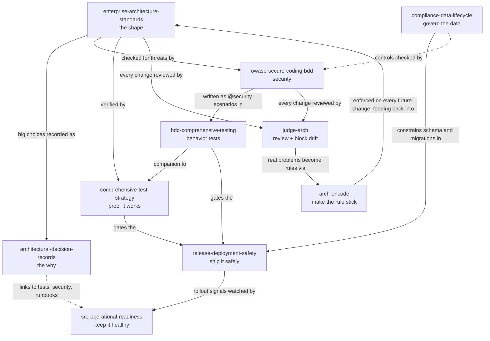

# Engineering Standards: Portable Agent Skills

[](LICENSE)
[](CONTRIBUTING.md)


Made and kept up by **[Tech Fleet](https://techfleet.org)**.

This repo holds 16 **skills**. A skill is a short, expert checklist. An AI coding
tool, or a person, reads it while doing the work. Each skill holds the know-how a
good senior engineer uses on a change: how to make it safe, how to test it, how
to ship it, and why a choice was made. With these skills, every change can meet
the same bar. Not just the changes an expert happens to look at.

The 16 skills come in two groups:

- **13 engineering skills** at the top level. They cover security, testing,
  architecture, releases, running in production, data rules, decision records,
  code review, rule-writing, provable checks, honest self-review, and picking a
  design pattern.
- **3 requirements skills** in the [`requirements/`](requirements/) folder. They
  make what you build work for everyone: every browser and device, every ability,
  and anyone no matter their background.

The skills never name a specific AI model, company, or product. So they work with
any AI tool. They also read fine as plain notes for a person.

> **New here?** Think of a skill as a short checklist your AI coding tool reads on
> its own when it fits the task. For example: "You are changing the login code, so
> here is how to keep it safe." You do not have to remember to ask for it. Each
> skill says when it should load.

### A few words used here

- **Agent / AI coding tool:** an AI assistant that writes code for you.
- **LLM:** the AI model behind the tool.
- **BDD:** a way to write tests as plain sentences.
- **ADR:** a short note that records why a decision was made.
- **SRE:** the work of keeping a system healthy in production.
- **CI:** the automatic checks that run when you push code.
- **PR:** a pull request, the way you propose a change.
- **Gate:** a check that must pass before a change can merge.

---

## Table of contents

- [Why this exists](#why-this-exists)
- [The skills](#the-skills)
- [Requirements skills (works for everyone)](#requirements-skills-works-for-everyone)
- [What is a "skill"?](#what-is-a-skill)
- [Install and use](#install-and-use)
- [Always-on: run every skill on every task](#always-on-run-every-skill-on-every-task)
- [Set it up and keep it current: the bootstrap](#set-it-up-and-keep-it-current-the-bootstrap)
- [Adopt the architecture gate, step by step](#adopt-the-architecture-gate-step-by-step)
- [How the skills fit together](#how-the-skills-fit-together)
- [Design principles](#design-principles)
- [Contributing](#contributing)
- [Repository layout](#repository-layout)
- [License](#license)
- [Acknowledgements](#acknowledgements)

---

## Why this exists

The thing that makes software production-ready is often **knowledge stuck in
people's heads**. The security engineer knows the lockout check must run before
the delete. The SRE wants a reliability target set before launch. The architect
knows why they picked one database over another. Not everyone has this knowledge.
It is easy to forget when a deadline is close. And it is almost never used on
every single change.

These skills take that knowledge and put it where the tool can read it. When
someone, or an AI tool, works on a feature, it pulls in the right skill and uses
it while doing the work. It checks the input for threats, writes the tests,
records the decision, and plans a safe database change. You do not have to hope a
reviewer catches the gap later.

Two kinds of people get value from the same files:

- **Engineers and AI-tool users** get a ready-made standard for security,
  testing, architecture, safe releases, and running the system.
- **Learners** get a clear, real picture of what careful, senior-level work looks
  like: the checklists, the trade-offs, and the "do not ship until..." rules.

---

## The skills

Each folder is one skill that stands on its own. The **When it kicks in** column
is a short version of the skill's `description`. That text is what the AI tool
uses to decide when to load the skill on its own.

| Skill | What it does | When it kicks in | Extra files |
|---|---|---|---|
| [`enterprise-architecture-standards`](enterprise-architecture-standards/) | Designs the system and its data with real trade-offs: structure, resilience, and scale. | You design, build, or rework a service, database, API, or system. | 9 refs |
| [`pattern-selector`](pattern-selector/) | Picks the design pattern that fits, or none, with the pros, cons, and trade-offs. | You design or rework any feature, class, module, or data flow; "which pattern?" | 5 refs, 1 script |
| [`architectural-decision-records`](architectural-decision-records/) | Writes down why a big choice was made. | You make an important choice: database, framework, contract, or login model. | 5 refs, 2 scripts |
| [`owasp-secure-coding-bdd`](owasp-secure-coding-bdd/) | Turns OWASP threat-modeling into runnable `@security` tests. | You touch login, input, sessions, files, APIs, permissions, dependencies, or AI code. | 15 refs |
| [`bdd-comprehensive-testing`](bdd-comprehensive-testing/) | Writes every use case and audience as plain-sentence tests, checked on every push. | Any behavior change: build, add, fix, or push. | 4 refs, 5 scripts |
| [`comprehensive-test-strategy`](comprehensive-test-strategy/) | Covers the rest of testing beyond BDD. | Any code others rely on: unit, integration, end-to-end, contract, load, chaos. | 5 refs |
| [`release-deployment-safety`](release-deployment-safety/) | Ships at scale with no outage. | Deploy, release, roll out, migrate, cut over, hotfix, roll back, or feature flag. | 5 refs |
| [`sre-operational-readiness`](sre-operational-readiness/) | Checks if it is safe to run in production. | Reliability targets, monitoring, alerts, on-call, incidents, runbooks. | 5 refs |
| [`compliance-data-lifecycle`](compliance-data-lifecycle/) | Handles private and regulated data safely. | PII, GDPR/CCPA, SOC2/ISO, audit logs, retention, backups, recovery. | 5 refs |
| [`judge-arch`](judge-arch/) | Reviews a change against four questions and blocks drift. | Before "done" or a PR: reviewing a diff, branch, or area. | 4 refs, 1 script |
| [`arch-encode`](arch-encode/) | Turns a caught mistake into a tested, enforced rule. | After catching drift; "add a rule so this never happens again." | 2 refs |
| [`verifiable-quality-gates`](verifiable-quality-gates/) | Proves each automated check can really catch a problem. | Adding or reviewing a CI check or guard; a green build you do not trust. | 3 refs, 2 scripts |
| [`skeptical-audit`](skeptical-audit/) | Backs every claim of fact with proof you can re-run. | Any claim of fact: audits, reviews, status, counts, "I checked X." | 1 ref, 1 script |

### What each skill makes you do

**`enterprise-architecture-standards`** uses the architecture, database, and
performance standards you would expect from a senior team at a big company. It
picks a structure on purpose, designs the database around real trade-offs,
chooses sync or async for a reason, and builds in timeouts, retries, and limits
from the start instead of adding them later.

**`pattern-selector`** starts each feature by naming the problem as a set of
forces. Then it checks if a pattern is even needed. Often the answer is no
pattern. If one fits, it picks the right one and states the pros, the cons, the
problem it prevents, the safety and running trade-offs, the simpler option it
turned down, and a test that proves it was used right. It covers the 23 classic
patterns plus enterprise, DDD, and security ones. It also lists anti-patterns for
when the job is to remove structure. A built-in check keeps every entry complete
and sourced.

**`architectural-decision-records`** treats a decision as unfinished until the why
is written down. It makes a numbered record (an ADR) in the same PR as the code.
The record names the options you did not pick and the downsides you accept. It
comes with scripts to create and check records.

**`owasp-secure-coding-bdd`** runs a threat-modeling pass against the full OWASP
Cheat Sheet Series, kept on disk with no web lookup. It applies the matching
safe-coding steps and writes them as runnable `@security` tests. It always runs
the lockout and accidental-delete safety check before any permission, access, or
delete change.

**`bdd-comprehensive-testing`** turns a change into the full set of behavior
tests: every use case (the happy path and every unhappy path), crossed with every
audience. It asks you when the audience is not clear, and never guesses. The tests
are written as valid Gherkin, a plain-sentence test format, and the official
parser checks them. They are sorted on a shared list, saved in the repo with an
add-only log, and checked on every push, so missing or broken coverage cannot
merge.

**`comprehensive-test-strategy`** owns the testing that behavioral BDD does not:
unit, integration, and end-to-end tests, contract tests between services, load
and chaos tests, property-based tests, and coverage and mutation checks. It also
shows how to keep flaky tests from rotting the suite.

**`release-deployment-safety`** turns "we merged it" into "it is safely live."
Zero-downtime deploys, canary, blue-green, and rolling rollouts, feature flags,
instant rollback, and database changes that stay backward-compatible so a deploy
never takes the system down.

**`sre-operational-readiness`** answers "is this safe to run?" before launch:
reliability targets and error budgets, the four golden signals, alerts that page
on real problems and not noise, incident response, blame-free postmortems,
runbooks, and a production-readiness review.

**`compliance-data-lifecycle`** handles personal and regulated data with care:
data classification, retention and deletion, audit logs you cannot tamper with,
GDPR/CCPA user rights, plus safe database changes, backups, and disaster recovery.

**`judge-arch`** reads a change the way a careful senior architect would, with
fresh eyes, against four questions. Is it in the right place? Who owns this data?
What does it now depend on? What happens when it breaks? It reports what it finds,
not fixes, or says PASS. It ships a small, dependency-free gate
(`arch-gate.mjs`) so the checkable rules block a merge instead of being just
advice. This is the layer that makes the other skills' standards actually stick.

**`arch-encode`** turns a caught mistake into a lasting rule: a clear "do not do
this" code example placed where the code lives, wired into the gate when it can be
checked, then proven to work by undoing the fix, clearing context, and running the
task again. It keeps rule files short and free of conflicts.

**`verifiable-quality-gates`** treats your automated checks as code that can
quietly stop working and still show green. A tightened pattern, a flipped
condition, or a moved file can break a check without anyone noticing. So each
check gets a saved test that runs the real check and fails when the check is
swapped for a do-nothing version. A mutation check proves this by machine. Checks
fail closed, and each rule is proven at the layer that owns it, not by a separate
monitor. It ships dependency-free coverage and mutation engines. This is the layer
that keeps the other skills' checks honest.

**`skeptical-audit`** treats your first answer as a guess until a measurement
proves it. Before any claim of fact ships, such as "it works," "tests pass," "it
is unused," "it is safe," or "I checked X," it attaches three things: an evidence
state (observed, inferred, documented, reported, or not-assessed), a source
someone else can re-run, and a named limit (what was not checked). It keeps "does
it follow the rule?" separate from "is the rule enough?", bans vague words used in
place of a real check, and gives an evidence list instead of comfort. An honest
"3 observed, 2 not-assessed" beats a confident "all good." It ships a
dependency-free `claim-lint` that flags vague words and untagged claims. This is
the layer that keeps every other skill's findings honest.

---

## Requirements skills (works for everyone)

The 13 skills above make software **correct**. These 3, grouped under
[`requirements/`](requirements/), make it **usable by everyone**: every browser
and device, every ability, and anyone no matter their situation, reading level, or
skill. The engineering skills ask "is this built, secured, tested, and run
correctly?" These ask "can anyone actually use what we built?"

| Skill | What it does | When it kicks in |
|---|---|---|
| [`universal-browser-device-support`](requirements/universal-browser-device-support/) | Works and looks right on every supported browser and device. | Any HTML/CSS/JS/UI change, responsive layout, "broken in Safari," mobile, touch. |
| [`universal-accessibility-wcag`](requirements/universal-accessibility-wcag/) | Meets WCAG 2.2 AA so keyboard, screen-reader, and magnifier users are not shut out. | Forms, images, color and contrast, focus, keyboard, ARIA, screen readers. |
| [`usability-ux-universal-design`](requirements/usability-ux-universal-design/) | Clear, simple design for the widest range of people. | New UI or flows, navigation, onboarding, empty and error states, wording. |

Use them in order on any UI change. First **works everywhere**: it loads and runs
wherever the user is. Then **accessible**: anyone with any ability can use it,
which is the floor the law often requires. Then **usable**: it is easy for anyone
on top of that. See the [requirements README](requirements/README.md) for how they
fit together.

---

## What is a "skill"?

A skill is a folder built around one `SKILL.md` file. It can have extra files the
tool reads only when it needs the detail:

```
<skill-name>/
  SKILL.md          # a short header (name + description) plus Markdown instructions
  references/*.md   # deep-dive material, read only when needed
  scripts/*         # optional helper scripts the skill can run
  assets/*          # optional drop-in files (templates, snippets)
```

`SKILL.md` starts with a short header, written in YAML, then plain Markdown:

```yaml
---
name: architectural-decision-records
description: "When to use this skill. This text is what triggers it."
---
# ...instructions in Markdown...
```

Two ideas make this work:

- **The `description` is a switch.** The AI tool reads it to decide if the skill
  fits the task. So it is written as *when to use this*, not *what this is*.
- **Load detail only when needed.** `SKILL.md` stays short and easy to scan. The
  heavy detail sits in `references/*.md` and loads only when the task needs it.
  This keeps the tool's context small.

This is, on purpose, the simplest shared format. Any tool that knows the SKILL.md
format reads it directly. Any model that does not can still read the file as plain
Markdown. Nothing here is tied to one company.

---

## Install and use

### AI tools that know SKILL.md (like Claude Code)

Put each `<skill-name>/` folder in a skills folder. The tool loads a skill on its
own when its `description` fits the task.

- **For all your projects:** copy folders into `~/.claude/skills/`.
- **For one repo, shared with the team:** copy them into `.claude/skills/` and commit.
- **As a bundle:** copy this whole repo and point your skills path at it.

```bash
# install one skill for all your projects
git clone https://github.com/techfleetworks/enterprise-software-AI-skills
cp -r enterprise-software-AI-skills/architectural-decision-records ~/.claude/skills/
```

### Rule-based tools (Cursor, Copilot, Windsurf)

Point your project rules at the right `SKILL.md`, or paste its body into your rules
file. Add the `references/*.md` files when you work in that area.

### Any other model, custom tool, or RAG

Use `SKILL.md` as a system-prompt piece or a lookup document. (RAG means a setup
where the tool looks up documents to help answer.) Read the `description` to check
if it fits, then feed the Markdown body, and any linked file, as context. It is
all plain Markdown, so it drops into a vector store or a prompt with no conversion.

---

## Always-on: run every skill on every task

By default a skill loads only when the task matches its `description`. That leaves
coverage up to chance, and it can skip the review and check skills right when a
change is rushed. The [`always-on/`](always-on/) folder makes **every skill in
this repo always-on**: considered on every task, for the main tool and every
helper it spawns, added by the system instead of left to the model to remember.

It works through hooks, because Claude Code has no setting that forces a skill to
load. A `SessionStart` hook adds the rule to the main tool, and a `SubagentStart`
hook adds it to every helper. The rule names the skills and makes using the right
ones required. It does not paste in the full skill text, since their descriptions
are already always in context. A lighter option is to add the rule to `CLAUDE.md`.

The hook runs a tiny committed script, `always-on/emit-directive.mjs`, in exec form
(bare `node`, no shell), so it does not quietly break on a machine where bash is
missing, and if the rule file ever goes missing it says so loudly instead of turning
enforcement off in silence.

The easiest way to set this up, and to keep it current, is the bootstrap below, which
does it for you with a backup and a check. To do it by hand for all your projects,
after cloning:

```bash
cp always-on/enterprise-skills-always-on.md ~/.claude/enterprise-skills-always-on.md
cp always-on/emit-directive.mjs ~/.claude/emit-directive.mjs
# then merge the hooks block from always-on/settings.snippet.json into ~/.claude/settings.json
```

Full steps, including personal vs project setup, the Windows fallback, the
confirm-it-works check, the CLAUDE.md option, and how to narrow it or turn it off, are
in the [`always-on/` README](always-on/).

---

## Set it up and keep it current: the bootstrap

Having the skills in a repo does nothing until the always-on hook is turned on and
actually firing. The [`bootstrap`](bootstrap/) skill does that for you, proves it
works, and keeps it current after an update. This matters when more than one person
uses the repo: when anyone pulls a new version, their machine needs to pick up the
latest skills without a fragile manual ritual.

Two ideas make that safe:

- **The hook points at the repo, not at copies.** So when you `git pull` a new
  version, your next session already runs the latest rule. No re-copying, nothing to
  go stale.
- **The installer reconciles, it does not just sit there.** The marker records a
  version. On a later session the hook adds a one-line "an update is available, run
  the bootstrap" note when you are behind, and the reconcile re-points the hook and
  bumps the marker, through the same plan, consent, and backup steps as a first
  install. `esk-init --check` is a CI drift gate that fails if someone is missing or
  behind.

It is safe by default: the installer never writes without `--yes`, backs up
`settings.json` first, validates what it wrote, and restores from the backup if
anything fails, so a failed install never leaves the repo half-configured. One thing
it cannot prove on its own is that a brand-new session really receives the rule, so it
finishes by asking you to open a fresh session and confirm. That honesty is the point:
a check that cannot see the end result says so.

```bash
node bootstrap/scripts/esk-init.mjs            # plan only, writes nothing
node bootstrap/scripts/esk-init.mjs --yes      # install or reconcile (backs up first)
node bootstrap/scripts/esk-init.mjs --check    # CI drift gate: fails if not installed or behind
```

Here is the whole sequence, from first install through staying current after a pull:


```mermaid
flowchart TD
    START1["FIRST TIME here (no hook installed yet):<br/>you run the bootstrap on purpose, from this one-liner or by invoking<br/>the skill. Nothing can auto-run before the first install."] --> F1

    START2["EVERY LATER session: the installed hook emits the rule (cheap) and<br/>reads two small version files. If the installed version is behind the<br/>repo, it adds ONE line: an update is available, run the bootstrap.<br/>It never writes or scaffolds on its own."] --> VQ{"Installed version behind<br/>the repo version?"}
    VQ -- "No" --> OK["Up to date. The rule is already injected every session. Nothing to do."]
    VQ -- "Yes, e.g. after a git pull" --> U1

    subgraph FRESH["First install - full setup"]
      F1{"Unsaved changes, or on main / a shared branch?<br/>(this path writes several files)"}
      F1 -- "Yes" --> F1a["Stop. Offer a separate work folder and branch first,<br/>so it never writes over unsaved work."]
      F1a --> F2
      F1 -- "No" --> F2["Look around the repo: stack, package manager, framework,<br/>database, CI, and any hook already set up."]
      F2 --> F3{"Anything still just a guess?<br/>(a fact needs 2+ agreeing clues)"}
      F3 -- "Yes" --> F3a["Do not act on a guess. Probe harder, or ask. Then look again."]
      F3a --> F2
      F3 -- "No" --> F4["Ask only what must never be guessed: users, uptime and speed targets,<br/>the kind of data stored, browsers and devices. No answer leaves a<br/>clear you decide this note, not a guess."]
      F4 --> F5["Show the WHOLE plan (add / change / skip + checks to turn on),<br/>then ask permission."]
      F5 --> F6{"Did you say go ahead?"}
      F6 -- "No" --> F6a["Stop. Nothing is written."]
      F6 -- "Yes" --> F7["Add only what is missing: never overwrite, BACK UP before any change,<br/>skip what exists; install the hook POINTED AT THIS REPO so future git<br/>pulls apply automatically. Log each step to ESK-INSTALL-LOG.md."]
    end

    subgraph UPD["After a git pull - reconcile (light, no repo-tree writes)"]
      U1["See what changed: new version, new skills, any NEW input the update needs."]
      U1 --> U2{"Does the update need a new answer from you?"}
      U2 -- "Yes" --> U2a["Ask only the new must-not-guess item(s)."]
      U2a --> U3
      U2 -- "No" --> U3["Show the small re-sync plan (which settings entry and marker change).<br/>BACK UP settings.json. Then ask permission."]
      U3 --> U4{"Did you say go ahead?"}
      U4 -- "No" --> U4a["Stop. Nothing is written."]
      U4 -- "Yes" --> U5["Re-point the hook at this repo and refresh the rule wiring.<br/>The repo tree is untouched, so no worktree is needed."]
    end

    F7 --> V1
    U5 --> V1

    subgraph VERIFY["Verify and record - both paths end here"]
      V1["Make today's build pass without hiding anything: existing style and<br/>structure problems become a dated, owned to-do list. SECURITY problems<br/>are NEVER put on that list; they are reported loudly and must be fixed."]
      V1 --> V2["Prove it works: run each check and confirm it runs and will block a bad<br/>change; run the hook command as configured and confirm it EMITS the rule<br/>and the settings entry is well-formed."]
      V2 --> V3{"All checks pass and the hook emits correctly?"}
      V3 -- "No" --> V3a["RESTORE every changed file from its backup, then stop loudly.<br/>Do NOT write the marker."]
      V3 -- "Yes" --> V4["Write the marker (repo version + date), the report, and a short summary.<br/>If any security findings are open, say so loudly: installed WITH N to fix."]
    end

    V4 --> CONFIRM["Recommended, and the only true proof: open a FRESH session and ask it to<br/>quote the first line of the rule, and have it spawn a subagent and do the same."]
    CONFIRM --> CI["From then on, CI runs the drift check: it fails if a piece is missing,<br/>drifted, the version fell behind, or a temporary exception expired."]

    style F1a fill:#ffe6e6
    style F3a fill:#ffe6e6
    style F6a fill:#ffe6e6
    style U4a fill:#ffe6e6
    style V3a fill:#ffe6e6
    style OK fill:#e6ffe6
    style V4 fill:#e6ffe6
    style U1 fill:#e6f0ff
    style U5 fill:#e6f0ff
    style CONFIRM fill:#fff4d6
```

> Scope note: today the installer owns the always-on hook lifecycle (install, verify,
> reconcile, drift). The broader artifact scaffolding in the diagram (asking for
> audiences and SLOs, baselining existing debt, turning on the other gates) is the next
> phase and plugs into the same plan, consent, backup, verify, and record framework.

---

## Adopt the architecture gate, step by step

The `judge-arch` and `arch-encode` skills come with a **gate** so your standards
are enforced, not just suggested. Here is how a team turns it on in a repo. It
takes about ten minutes, and your current code does **not** have to be clean first.

> On a **React + Supabase** codebase, skip the by-hand setup. Use the ready
> [`react-supabase` preset](judge-arch/assets/presets/react-supabase/). It does
> steps 2 and 3 for you.

**1. Get the skills into the repo.** Clone this repo, or copy it in as a bundle.
Then copy the two review skills into your repo's committed skills folder so every
teammate's tool loads them:

```bash
git clone https://github.com/techfleetworks/enterprise-software-AI-skills
cp -r enterprise-software-AI-skills/judge-arch   .claude/skills/
cp -r enterprise-software-AI-skills/arch-encode  .claude/skills/
git add .claude/skills && git commit -m "Add architecture review + gate skills"
```

**2. Turn on the always-on rules.** Copy the vendor-neutral baseline into your
repo's `AGENTS.md`, make one if you do not have it, drop the scoped rules into the
folders they cover, and start a `decisions.md` that you fill with pointers to your
*own* good code:

```bash
cp enterprise-software-AI-skills/judge-arch/assets/AGENTS.baseline.md      AGENTS.md
cp enterprise-software-AI-skills/judge-arch/assets/decisions.template.md   decisions.md
# scoped rules, for example: src/components/AGENTS.md, src/services/AGENTS.md, supabase/functions/AGENTS.md
```

**3. Install the gate.** The scanner needs no `npm install`:

```bash
cp enterprise-software-AI-skills/judge-arch/scripts/arch-gate.mjs                 scripts/arch-gate.mjs
cp enterprise-software-AI-skills/judge-arch/assets/arch-gate.config.example.json  arch-gate.config.json
# edit arch-gate.config.json so its globs and forbidden patterns match your layers
```

**4. Record your current debt, so the gate is green on day one.** Make a waiver
file that grandfathers every current problem. The gate then blocks **new**
problems while your backlog is listed and dated. It only gets stricter over time:

```bash
node scripts/arch-gate.mjs --baseline > arch-gate.waivers.json
```

**5. Wire it into CI and your hooks.**

```jsonc
// package.json  ->  scripts
"check:architecture":     "node scripts/arch-gate.mjs --changed",  // checks changed files on a PR
"check:architecture:all": "node scripts/arch-gate.mjs"             // scans everything
```
```bash
cp enterprise-software-AI-skills/judge-arch/assets/arch-gate.workflow.yml  .github/workflows/arch-gate.yml
# and add `npm run check:architecture` to your pre-push hook
```

From now on, **nothing is "done" until `check:architecture` exits 0 and a
`judge-arch` review is clean or waived on purpose.** The only way around it is a
dated, signed waiver. Never a self-declared "it is trivial." When you catch a
**new** bad pattern, use `arch-encode` to turn it into a rule and a gate check so
it cannot come back.

### Where each file goes, and what to change

Everything here is either the **shared standard**, which you use as-is, or a
**template** you copy into your repo and fill in. The full file-by-file map is in
[`judge-arch/references/adoption.md`](judge-arch/references/adoption.md). The main
ones:

| From the clone | Copy to your repo as | Edit after copying? |
|---|---|---|
| `judge-arch/`, `arch-encode/` (whole folders) | `.claude/skills/...` (committed) or `~/.claude/skills/...` | **No.** The shared skill and engine. |
| `judge-arch/scripts/arch-gate.mjs` | `scripts/arch-gate.mjs` | **No.** The engine; your config drives it. |
| `judge-arch/assets/AGENTS.baseline.md` | `AGENTS.md` | **Yes.** Add your specifics below the divider line. |
| `judge-arch/assets/decisions.template.md` (or a preset's `decisions.md`) | `decisions.md` | **Yes.** Fill the good/bad lists with pointers to your own code. |
| a preset's `arch-gate.config.json` (or `assets/arch-gate.config.example.json`) | `arch-gate.config.json` | **Yes.** Set globs and client path to your folders. |
| a preset's `scoped/*.AGENTS.md` | the folder each one covers (for example `src/components/AGENTS.md`) | Usually **No**. |
| `judge-arch/assets/arch-gate.workflow.yml` | `.github/workflows/arch-gate.yml` | Minor. Your Node version. |
| (generated, not copied) | `arch-gate.waivers.json` | `node scripts/arch-gate.mjs --baseline` |

**`AGENTS.md`, `decisions.md`, and `arch-gate.config.json` are templates.** The
files `AGENTS.baseline.md`, `decisions.template.md`, and the preset config are the
blanks in this repo. Every team copies them and points them at *their own* code.
Only the skill folders and the gate engine are used as-is.

---

## How the skills fit together

No skill works alone. One feature usually pulls in several, and they point to each
other on purpose. Architecture sets the shape. ADRs record why. Security and
testing prove it. Release and SRE get it live safely and keep it healthy.
Compliance governs the data under it.


```mermaid
flowchart TD
    ARCH[enterprise-architecture-standards<br/>the shape]
    ADR[architectural-decision-records<br/>the why]
    SEC[owasp-secure-coding-bdd<br/>security]
    BDD[bdd-comprehensive-testing<br/>behavior tests]
    TEST[comprehensive-test-strategy<br/>proof it works]
    REL[release-deployment-safety<br/>ship it safely]
    SRE[sre-operational-readiness<br/>keep it healthy]
    COMP[compliance-data-lifecycle<br/>govern the data]

    ARCH -->|big choices recorded as| ADR
    ARCH -->|checked for threats by| SEC
    ARCH -->|verified by| TEST
    SEC -->|written as @security scenarios in| BDD
    BDD -->|companion to| TEST
    BDD -->|gates the| REL
    TEST -->|gates the| REL
    REL -->|rollout signals watched by| SRE
    COMP -->|constrains schema and migrations in| REL
    COMP -.->|controls checked by| SEC
    ADR -.->|links to tests, security, runbooks| SRE

    JUDGE[judge-arch<br/>review + block drift]
    ENC[arch-encode<br/>make the rule stick]
    ARCH -->|every change reviewed by| JUDGE
    SEC -->|every change reviewed by| JUDGE
    JUDGE -->|real problems become rules via| ENC
    ENC -->|enforced on every future change, feeding back into| ARCH
```

The `architectural-decision-records` skill ties it together. Its records point to
the tests that confirm a choice, the security scenarios it needs, and the
operations plan it shapes.

---

## Design principles

- **No vendor names.** No model, company, or product names in skill content. So a
  skill works with any AI tool, and reads fine to a person.
- **Useful over complete.** Skills are short working standards, not textbooks.
  `SKILL.md` stays easy to scan. Depth goes in `references/`.
- **Load detail only when needed.** Read the short instructions first. Pull heavy
  reference material only when the task needs it.
- **Standards are required, but applied quietly.** The skills hold a firm bar
  ("not done until it is tested, secured, and recorded"). They do it by doing the
  work as part of the task, not by lecturing you about process.
- **Right-sized.** A three-line ADR for a small choice. The full test pyramid only
  for code others rely on. The skills also tell you when less is correct.

---

## Contributing

Contributions and forks are welcome. See [CONTRIBUTING.md](CONTRIBUTING.md) for the
full guide. In short:

1. Keep it **vendor-neutral**: no model, company, or product names.
2. Follow the **format**: `SKILL.md` with valid YAML frontmatter (put quotes
   around any `description` that has a `:`), depth in `references/`, and a
   kebab-case folder name that matches the frontmatter `name`.
3. Open a PR that says what the skill helps a tool do and **when it should load**.
   The `description` is what tools use to pick it.

Adding a new skill can be as small as one file:

```yaml
---
name: your-skill-name
description: "When to use this skill. This text is what triggers it."
---
# Instructions in Markdown...
```

---

## Repository layout

```
.
├── enterprise-architecture-standards/
├── architectural-decision-records/
├── judge-arch/                            # review a change + the gate that blocks drift
├── arch-encode/                           # turn a caught mistake into an enforced, tested rule
├── verifiable-quality-gates/              # prove every automated check can really catch a problem
├── skeptical-audit/                       # back every claim with proof you can re-run
├── owasp-secure-coding-bdd/
├── bdd-comprehensive-testing/             # every use case and audience as tagged, logged Gherkin
├── comprehensive-test-strategy/
├── release-deployment-safety/
├── sre-operational-readiness/
├── compliance-data-lifecycle/
├── requirements/                          # the works-for-everyone skills (grouped)
│   ├── universal-browser-device-support/
│   ├── universal-accessibility-wcag/
│   ├── usability-ux-universal-design/
│   └── README.md
├── always-on/                             # make every skill run on every task (SessionStart + SubagentStart hooks)
├── CONTRIBUTING.md
├── LICENSE
└── README.md
```

Every skill folder follows the same shape: a `SKILL.md` file plus `references/`,
and optional `scripts/` and `assets/`. The three works-for-everyone skills sit one
level down under `requirements/`, and each is still its own self-contained folder.

---

## License

[MIT](LICENSE) © [Tech Fleet](https://techfleet.org). Use, fork, change, and share
freely with attribution.

**One exception:** the `owasp-secure-coding-bdd/vendor/` folder holds OWASP content
(the Cheat Sheet Series and the Top 10 for LLM Applications). OWASP publishes it
under **CC-BY-SA-4.0**, not MIT. It is fetched from source on demand by
`npm run vendor:owasp` and kept separate under its own license. It is not
committed. If you share that text, you must follow CC-BY-SA-4.0: give attribution
and share alike. The OWASP skill's own files describe the controls in their own
words and quote only short, credited bits, which fits this repo's MIT license. See
`owasp-secure-coding-bdd/vendor/NOTICE.md`.

---

## Acknowledgements

The `architectural-decision-records` skill adapts the ADR practice and templates
from the ADR community ([adr.github.io](https://adr.github.io/)), Michael Nygard's
original ADR idea ("Documenting Architecture Decisions", 2011), and the MADR
project ([adr.github.io/madr](https://adr.github.io/madr/)).

The `owasp-secure-coding-bdd` skill is grounded in the
[OWASP Cheat Sheet Series](https://cheatsheetseries.owasp.org/), © the OWASP
Foundation.

The `judge-arch` and `arch-encode` skills are adapted from the certificates.dev
workshop "Who's Designing Your System? You, or Your Agent?"
